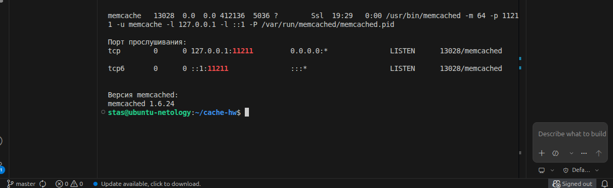
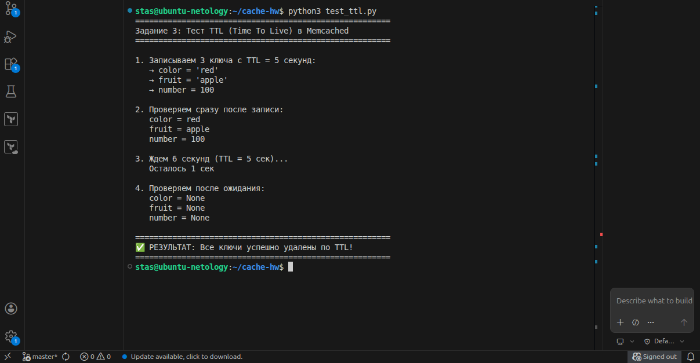
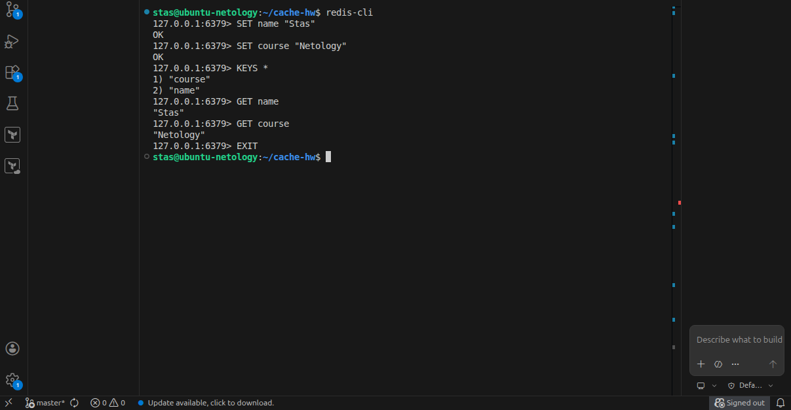

# Домашнее задание: Кеширование

**Студент:** Stas Lukin
**Репозиторий:** https://github.com/stas-lukin/cache-hw

---

## Задание 1. Проблемы, которые решает кеширование

1. Высокая нагрузка на базу данных
2. Медленное время ответа сервера
3. Дорогие вычисления
4. Пиковые нагрузки
5. Задержки внешних API
6. Избыточное потребление CPU
7. Сетевой трафик

---

## Задание 2. Установка и запуск Memcached

**Статус Memcached:**

Memcached запущен на порту 11211.

---

## Задание 3. Удаление по TTL в Memcached

**Тест TTL:** ключи с TTL=5 секунд, проверка через 6 секунд.

**Результат:**

✅ Все ключи успешно удалены по TTL.

---

## Задание 4. Запись данных в Redis

**Команды в redis-cli:**
- SET name "Stas"
- SET course "Netology"
- KEYS *
- GET name
- GET course

**Результат:**

---

## Итог

| Задание | Статус |
|---------|--------|
| Задание 1. Теория кеширования | ✅ |
| Задание 2. Memcached запуск | ✅ |
| Задание 3. TTL в Memcached | ✅ |
| Задание 4. Redis запись/чтение | ✅ |

---

**Ссылка для сдачи:** https://github.com/stas-lukin/cache-hw
